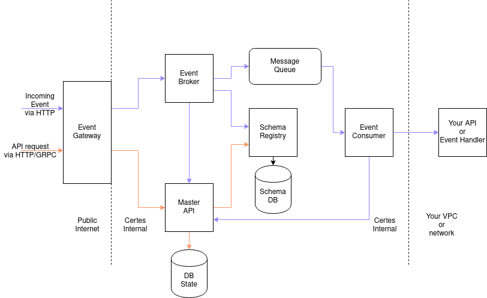

# Certes

## Overview

Certes is a standard for asynchronous web events, traditionally known as "[webhooks](https://webhooks.dev/docs/basics/)". 



## Goals

1. Standardize asynchronous event handling
1. Standardize an interface for creating and managing event subscriptions
1. Standardize the monitoring and tracing of asynchronous events
1. Standardize the format of asynchronous event data
1. Minimal latency increase (up to 150ms from event received to processed)
1. Maintain an open source community for changes, feedback, and guidance
1. Deploy anywhere with many options (e.g. single binary, docker, k8s, etc.)
1. Programming language agnostic client usage

## Non-goals

1. Introduce a new internet protocol (build on existing protocols such as [HTTP](https://en.wikipedia.org/wiki/Hypertext_Transfer_Protocol), [GRPC](https://grpc.io/), [DNS](https://www.cloudflare.com/learning/dns/what-is-dns/), etc.)
1. Solve 100% of asynchronous event problems (i.e. solving the top 20% of pain points/issues may actually solve all the problems for 80% of people)
1. Re-invent the wheel (i.e. use existing open source tools when possible as long as they add minimal latency)

## Small client example

Meetly (made up company) wants to receive events from GitHub. In this example, GitHub does not natively support Certes so the community has created and uploaded the event schema to `community.certes.dev` for anyone to use.

**NOTE:** this does not compile or work, it is just an example of what Certes _could_ be.

```go
package main

import (
  "fmt"
  "net/http"

  certes "github.com/hookactions/certes-sdk/go"
  gh "github.com/hookactions/certes-contrib/github"
)

func init() {
  certes.Init("events://events.meetly.com")  // Meetly's event gateway, local or hosted by 3rd party
  
  certes.EnsureSubscriptions(
    certes.Event("community.certes.dev/github/1/push", nil),
    certes.Event("community.certes.dev/github/1/issues", &gh.Opts{
      Repo: "meetly/app",
    }),
    certes.Event("community.certes.dev/github/1/membership", &gh.Opts{
      Org: "meetly",
    }),
    certes.Event("community.certes.dev/github/1/*", &gh.Opts{
      Repo: "meetly/meetly",
    }),
  )
}

func main() {
  certes.On("community.certes.dev/github/1/push", func(raw *certes.RawEvent) error {
    var event gh.PushEvent
    if err := raw.To(&event); err != nil {
      return err
    }

    fmt.Printf("Got Github push event: %#v\n", event)
    return nil
  })

  http.HandleFunc("/", certes.HttpHandler())
  log.Fatal(http.ListenAndServe(":8080", nil))
}
```

```javascript
import certes from "@certes/sdk";
import {github as gh} from "@certes/contrib";
import express from "express";

certes.init("events://events.meetly.com");
certes.ensureSubscriptions([
  certes.event("community.certes.dev/github/1/push"),
  certes.event("community.certes.dev/github/1/issues", {
    repo: "meetly/app",
  }),
  certes.event("community.certes.dev/github/1/membership", {
    org: "meetly",
  }),
]);

certes.on("community.certes.dev/github/1/push", (raw) => {
  const event = raw as gh.PushEvent;  // in typescript, omit for regular JS
  console.log(`Got GitHub push event: ${event}`);
});

const app = express();
const port = 8080;

app.post("/", certes.expressHandler());
app.listen(port, () => console.log(`Listening at http://localhost:${port}`));
```

## Small producer example

GitHub wants to send events to Meetly who has subscribed to some events.

**NOTE:** this does not compile or work, it is just an example of what Certes _could_ be.

```go
package main

import (
  certes "github.com/hookactions/certes-sdk/go"
  pbv1 "./pb/v1"  // locally generated protobuf code
  pbv2 "./pb/v2"  // locally generated protobuf code
)

func init() {
  certes.Init("events://events.github.com") // GitHub's event gateway, local or hosted by 3rd party
}

func main() {
  meetlyGhId := "org_123"

  // Something in our code triggers a "push" event for Meetly
  certes.SendOutgoingEvent(meetlyGhId, &pbv1.PushEvent{
    Ref: "refs/tags/simple-tag",
    Before: "6113728f27ae82c7b1a177c8d03f9e96e0adf246",
    // ... data here related to "push"
  })
  certes.SendOutgoingEvent(meetlyGhId, &pbv2.PushEvent{
    Ref: "refs/tags/simple-tag",
    BeforeCommitSha: "6113728f27ae82c7b1a177c8d03f9e96e0adf246",  // versioning example of field name changing
    // ... data here related to "push"
  })
}
```
